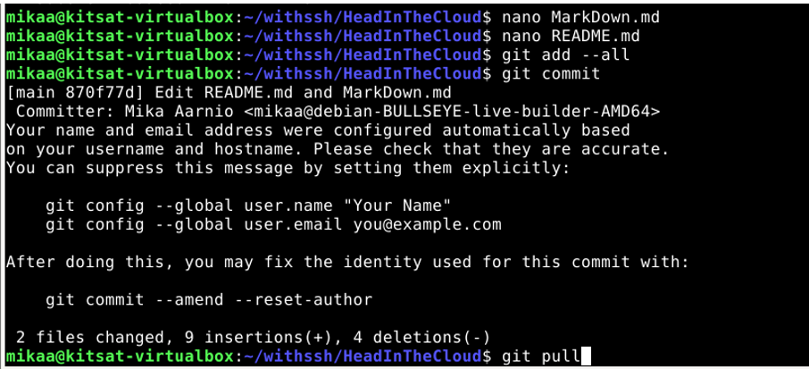
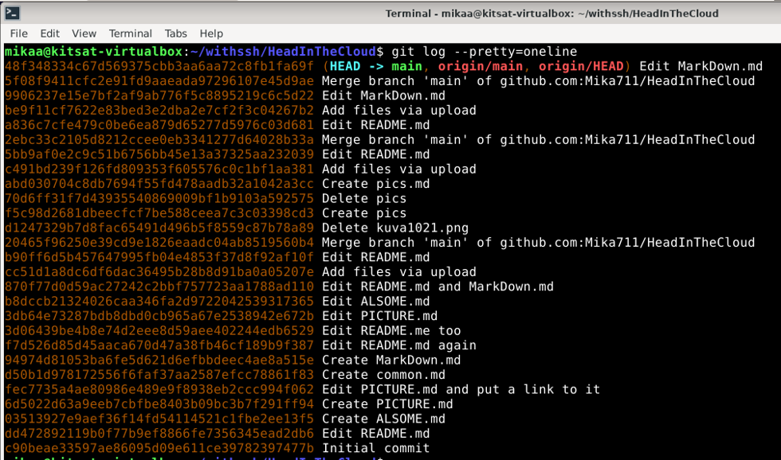
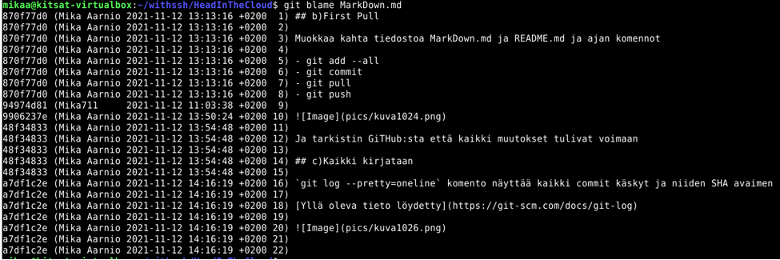
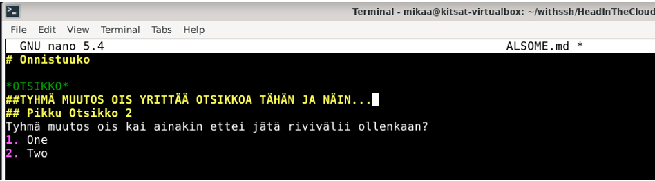
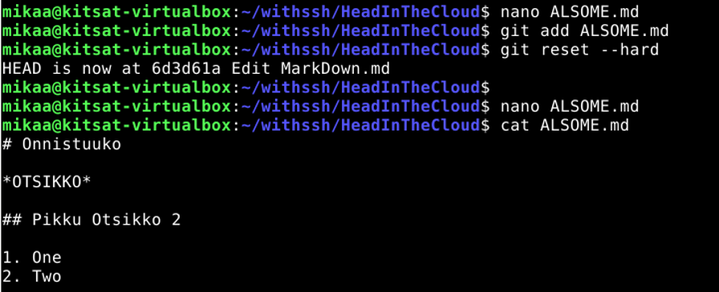
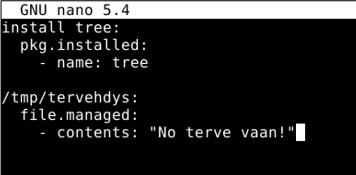
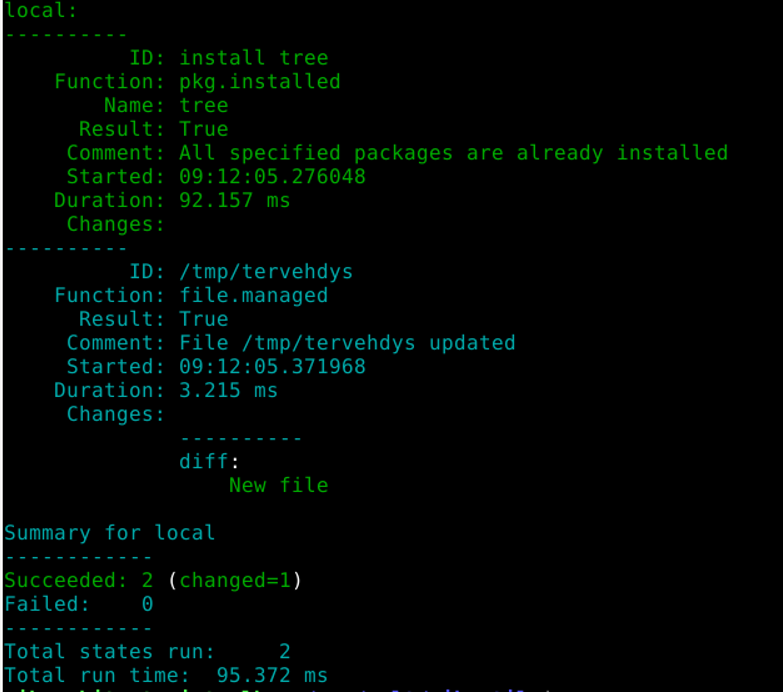

## H3 Versionhallinta

## z)Lue ja tiivistä

[https://commonmark.org/help/](https://commonmark.org/help/)

- Kappaleiden väliin aina tyhjä rivi

- `_kursivoitu_` tulee _kursivoitu_ teksti

- `**lihavoitu**` tulee **lihavoitu** teksti

- `# Otsikko tai ## Otsikko` tulee otsikko

- Linkki tehdään `[Link](url)`

- Kuva lisätään ``

- Lista tehdään - merkillä

## a)Tee raportti MarkDown:na

Se on tässä :-)

## b)First Pull

Muokkaa kahta tiedostoa MarkDown.md ja README.md ja ajan komennot

- git add --all
- git commit
- git pull
- git push

Ja tarkistin GiTHub:sta että kaikki muutokset tulivat voimaan

## c)Kaikki kirjataan

`git log --pretty=oneline` komento näyttää kaikki commit käskyt ja rivien alussa on blockchain, eli lohkoketju

[Yllä oleva tieto löydetty](https://git-scm.com/docs/git-log)

`git blame MarkDown.md`komento näyttää kirjaimellisesti kenen vika (blame) tai ansioita täällä tehdyt asiat ovat. Kuvassa näkyvä aikavyöhyke on oikea, sekä kuvassa esiintyvät kellonajan ovat oikeita.

`git diff`komento näyttää viime commit käskyn jälkeen tehdyt muutokset, mutta en saa sillä mitään tulostetta aikaiseksi vaikka sitä missä kohtaa vaan yritän antaa?

`git diff --cached` olisi ollut komento mitä tässä olisi myös voinut käyttää ja saada muutokset näkyviin

## d)Huppis!

Tee tyhmä muutos gittiin, älä tee commit:tia. Tuhoa huonot muutokset ‘git reset --hard’. Huomaa, että tässä toiminnossa ei ole peruutusnappia.

Tein tyhmän muutoksen varmuudenvuoksi ALSOME.md tiedostoon

Sitten ajoin komennot

`git add ALSOME.md` ja
`git reset --hard`

Ja tarkistin cat-komennolla, että tekemäni tyhmät muutokset poistuivat

## e)Formula

Tee uusi salt-tila (formula, moduli, infraa koodina). (Eli uusi tiedosto esim. /srv/salt/terontila/init.sls). Voit tehdä ihan yksinkertaisen parin funktion (pkg, file...) tilan, tai edistyneemmin asentaa ja konfiguroida minkä vain uuden ohjelman: demonin, työpöytäohjelman tai komentokehotteesta toimivan ohjelman. Käytä tarvittaessa ‘find -printf “%T+ %p\n”|sort’ löytääksesi uudet asetustiedostot.

Loin aluksi uuden hakemiston nimeltään mikantila komennolla `sudo mkdir -p /srv/salt/mikantila` ja sinne init.sls tiedostoon kuvan mukaiset komennot. Kuvassa myös näkyy, että loin polkuun /tmp/ tervehdys nimisen tiedoston, jossa siis lukee "No terve vaan!"

Tämän jälkeen ajoin komennon `sudo salt-call --local -l info state.apply mikantila` ja kaikki näytti olevan ok 

## Lähteet:

- Kurssin sivut: [https://terokarvinen.com/2021/configuration-management-systems-palvelinten-hallinta-ict4tn022-2021-autumn/](https://terokarvinen.com/2021/configuration-management-systems-palvelinten-hallinta-ict4tn022-2021-autumn/)

- Raportointiohje: [https://terokarvinen.com/2006/raportin-kirjoittaminen-4/](https://terokarvinen.com/2006/raportin-kirjoittaminen-4/)

- Muita ohjeita:

 [https://terokarvinen.com/](https://terokarvinen.com/)

 [https://stackoverflow.com/questions/35229535/how-to-execute-pkg-refresh-db-in-a-salt-state](https://stackoverflow.com/questions/35229535/how-to-execute-pkg-refresh-db-in-a-salt-state)

 [https://commonmark.org/help/](https://commonmark.org/help/)

 [https://git-scm.com/docs/git-log](https://git-scm.com/docs/git-log)

